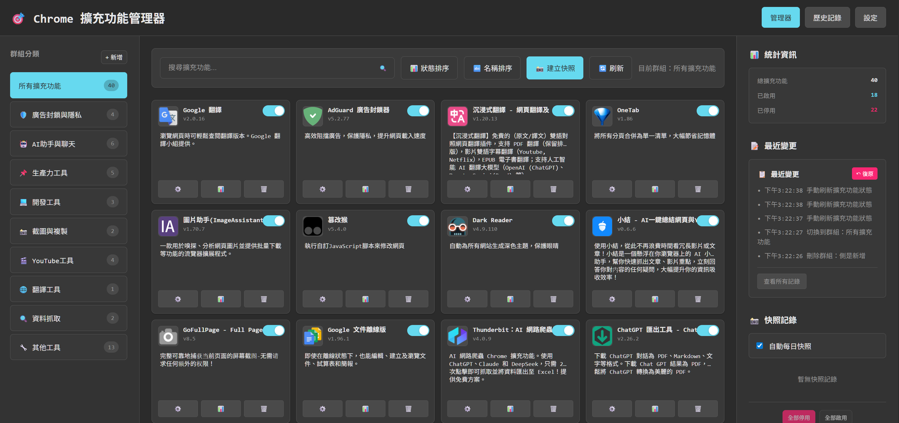
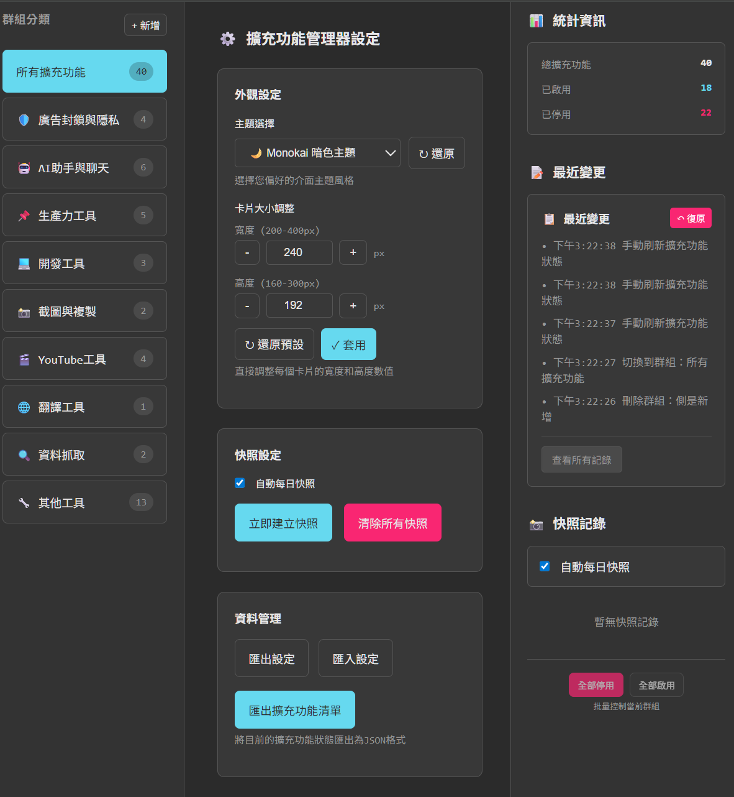
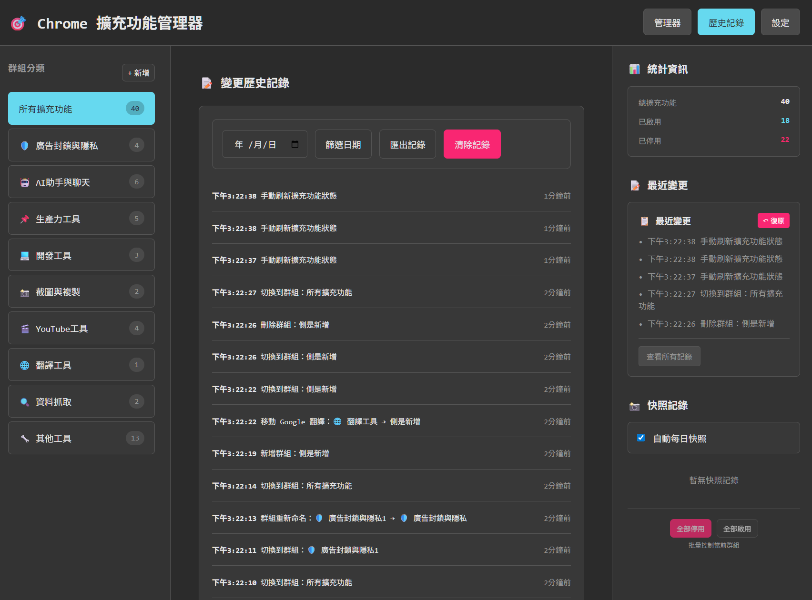
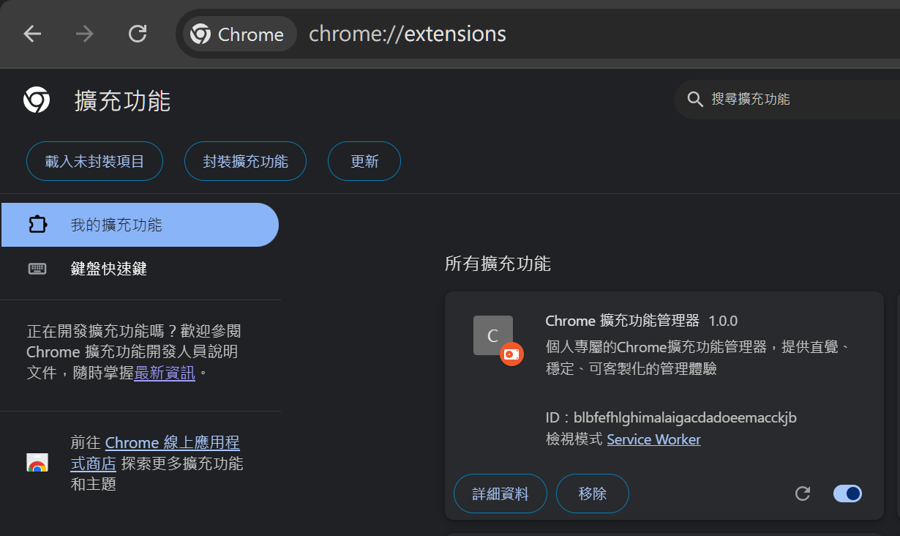
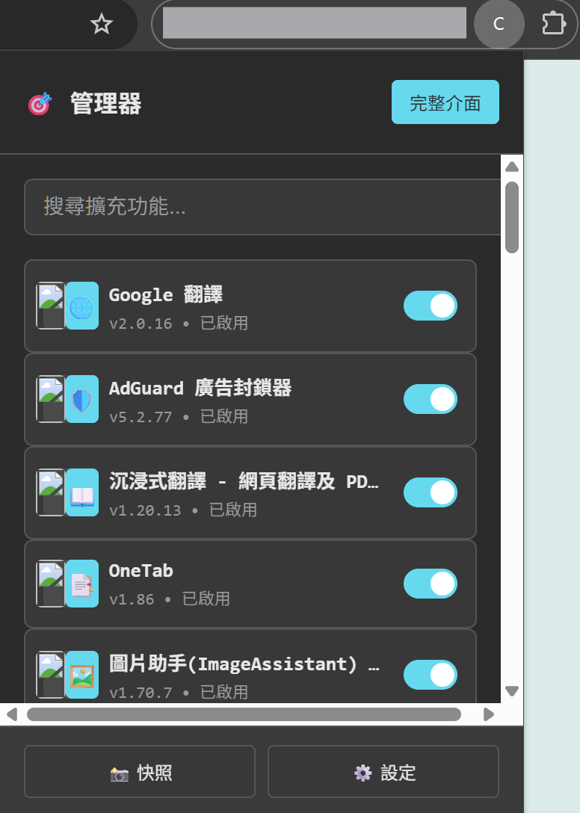

# 🎯 Chrome 擴充功能管理器

[](https://opensource.org/licenses/MIT)
[](https://developer.chrome.com/docs/extensions/)
[](https://developer.chrome.com/docs/extensions/mv3/intro/)

個人專屬的Chrome擴充功能管理器，提供比原生更直覺、穩定、可客製化的管理體驗。



> 🚀 **輕量快速** • 🎨 **專業外觀** • 🔧 **高度客製化** • 🛡️ **隱私安全**

## ✨ 功能亮點

這個擴充功能解決了 Chrome 原生管理介面複雜且缺乏客製化的問題，提供了以下核心功能：

- **🎯 直覺式管理介面**:
  - **即時狀態顯示**: 一眼掌握所有擴充功能的啟用狀態。
  - **一鍵開關控制**: 直接在卡片上切換，無需進入設定頁面。
  - **智能分類系統**: 預設 10 個功能群組，支援自訂分類與拖放排序。

- **📝 個人化設定**:
  - **可編輯描述**: 為每個擴充功能加上 10-30 字的個人化簡述。
  - **自訂群組管理**: 建立您專屬的分類系統，組織方式完全由您決定。
  - **主題偏好記憶**: 自動記住您的主題選擇和介面配置。

- **📸 快照與歷史系統**:
  - **手動快照**: 一鍵建立當前狀態的完整記錄。
  - **自動備份**: 支援每日自動快照功能（可設定）。
  - **變更追蹤**: 記錄每一次操作，支援快速還原到任意時間點。
  - **批量操作**: 群組批量啟用/停用，大幅提升管理效率。

- **🎨 專業視覺體驗**:
  - **Monokai 暗色主題**: 採用 VS Code 經典配色，護眼且專業。
  - **響應式佈局**: 自動適應 1-4 列卡片顯示，完美支援各種螢幕尺寸。
  - **無橫向滾動**: 精心設計的佈局確保所有內容都在視窗範圍內。

- **🔍 強大的搜尋與排序**:
  - **即時搜尋**: 輸入關鍵字立即篩選，支援名稱和描述搜尋。
  - **多重排序**: 按狀態、名稱、安裝時間等多種方式排序。
  - **智能過濾**: 依群組快速篩選，找到目標擴充功能更容易。

- **💾 可靠的資料管理**:
  - **本機儲存**: 所有資料存在您的電腦上，隱私完全受保護。
  - **匯出匯入**: 支援設定備份和跨裝置同步。
  - **智慧過濾**: 自動排除系統保護的擴充功能，避免誤操作。

### 主要特色實現
- **即時狀態同步**：監聽 `chrome.management.onEnabled/onDisabled` 事件
- **拖放功能**：使用 HTML5 Drag & Drop API 實現群組分類
- **主題系統**：CSS 變數配合 JavaScript 動態切換
- **響應式佈局**：CSS Grid 自動適應 1-4 列顯示

|  |  |
|:---:|:---:|
| **高度客製化的設定頁面** | **清晰易讀的變更歷史** |

> 💡 **技術提示**：此專案展示了如何使用 Chrome Extension API 建立功能完整的管理工具，所有原始碼都可作為學習或改進的參考基礎。

## 🎨 v1.1.0 圖標更新 (2025-09-24)

- **優化圖標設計**: 採用全新「堆疊卡片」設計，並使用高對比度的亮藍色主題，大幅提升在工具列中的可視性與辨識度。
- **自動化生成**: 圖標由 SVG 向量稿自動生成為各尺寸 PNG，確保品質一致。

  


## 🔧 安裝教學

### 前置需求
- Chrome 瀏覽器（支援 Manifest V3）
- 開發人員模式權限


### 安裝步驟

1.  **下載或複製專案檔案**
    - 下載此專案的所有檔案到本機資料夾
    - 確保資料夾包含 `manifest.json` 等核心檔案

2.  **開啟 Chrome 擴充功能頁面**
    - 在瀏覽器網址列輸入 `chrome://extensions/`
    - 或透過選單：更多工具 → 擴充功能

3.  **啟用開發人員模式**
    - 點擊右上角的「開發人員模式」切換開關
    - 切換開關變為藍色即表示已啟用

4.  **載入擴充功能**
    - 點擊左上方的「載入未封裝項目」按鈕
    - 瀏覽並選擇您下載的專案資料夾中的 **`extension`** 資料夾
    - 點擊「選取資料夾」完成安裝

5.  **確認安裝成功**
    - 擴充功能清單中會出現「Chrome 擴充功能管理器」
    - 瀏覽器工具列會顯示擴充功能圖標（如果有提供圖標檔案）



### 可選：自訂新增圖標檔案
在專案的 `icons/` 資料夾中放入以下圖標檔案：
- `icon16.png` (16x16 像素) - 工具列小圖標
- `icon48.png` (48x48 像素) - 擴充功能頁面圖標
- `icon128.png` (128x128 像素) - Chrome 應用商店圖標

> 💡 **提示**：圖標檔案不影響功能運行，可以稍後補充或使用自訂圖案
### 安裝注意事項

- **環境設定**：請確認您的 Chrome 版本支援 Manifest V3，並在 Chrome 中以「載入未封裝項目」的方式進行測試。
- **安裝失敗**：若安裝失敗，請優先確認「開發人員模式」已開啟，且選擇的資料夾結構正確（包含 `manifest.json` 的根目錄）。
- **權限確認**：安裝時 Chrome 會提示需要相關權限，請點擊允許以便擴充功能正常運作。

## 📖 使用指南

### 快速上手

1.  安裝完成後，您可以透過以下兩種方式開啟管理介面：
    - **快速彈窗**：點擊瀏覽器工具列的擴充功能圖標
    - **完整介面**：右鍵點擊圖標選擇「選項」，或在彈窗中點擊「完整介面」



2.  **基本操作**：
    - **開關擴充功能**：點擊卡片右上角的藍色切換開關，即時啟用或停用
    - **查看詳細資訊**：點擊卡片右下角的「ⓘ」按鈕，查看版本、權限等詳細資訊
    - **開啟設定頁面**：點擊卡片中的「⚙️ 設定」按鈕，直接跳轉到該擴充功能的選項頁面

3.  **搜尋與篩選**：
    - 在頂部搜尋框輸入關鍵字，系統會即時搜尋名稱和描述
    - 點擊左側的群組名稱進行分類篩選
    - 使用「狀態排序」和「名稱排序」按鈕改變顯示順序

### 進階功能

1.  **個人化描述**：
    - 點擊任一擴充功能卡片中的描述文字
    - 在彈出的編輯框中輸入您的個人化描述（10-30字建議）
    - 按 Enter 或點擊其他地方自動儲存

2.  **快照管理**：
    - **建立快照**：點擊右側面板的「📸 建立快照」按鈕
    - **查看歷史**：在右側面板查看所有快照記錄
    - **一鍵還原**：點擊任一快照項目，確認後即可還原到該時間點的狀態
    - **自動快照**：在設定頁面中可開啟每日自動快照功能

3.  **群組管理**：
    - **使用預設分類**：系統提供 10 個智能分類群組：
      - 🛡️ 廣告封鎖與隱私、🤖 AI助手與聊天、📌 生產力工具
      - 💻 開發工具、📸 截圖與複製、🎬 YouTube工具
      - 🌐 翻譯工具、🔍 資料抓取、🔧 其他工具
    - **建立自訂群組**：點擊群組區域底部的「+ 新增群組」按鈕
    - **編輯群組名稱**：雙擊任一自訂群組名稱進行編輯
    - **刪除群組**：點擊自訂群組旁的「×」按鈕（預設群組無法刪除）
    - **拖放分組**：直接將擴充功能卡片拖拉到目標群組中

4.  **批量操作**：
    - 選擇一個群組後，使用右側面板底部的批量操作按鈕
    - 可一次啟用或停用整個群組的所有擴充功能
    - 所有批量操作都會記錄在變更歷史中，支援復原

5.  **個人化設定**：
    - **主題切換**：在設定頁面選擇 Monokai 暗色主題或明亮主題
    - **顯示選項**：調整卡片密度、是否顯示描述等
    - **資料管理**：匯出您的設定和快照資料，或匯入先前的備份

> 💡 **提示**：圖標檔案不影響功能運行，可以稍後補充或使用自訂圖案
## 🛡️ 隱私與安全

- ✅ **完全本機運行** - 不會發送任何資料到外部伺服器
- ✅ **開源透明** - 所有程式碼都可查看和修改
- ✅ **最小權限** - 只請求必要的權限
- ✅ **無追蹤** - 不收集任何使用統計或個人資料

## 🐛 已知限制

1. **無法正常調用、顯示原有的圖標** - 沒有公開API支援此功能
2. **無法修改「允許在無痕模式」設定** - 這是Chrome的私有API，只能手動在擴充功能詳情頁設定
3. **無法修改其他擴充功能的內部設定** - 僅能操作主要設定頁面的開關控制。

## 🆘 常見問題

### 擴充功能無法運作？
- **重新載入**：在 `chrome://extensions/` 頁面點擊本擴充功能的「重新載入」按鈕
- **檢查主控台**：在擴充功能管理頁面按 `F12` 開啟開發者工具，查看「主控台 (Console)」是否有錯誤訊息
- **確認版本**：確保您的 Chrome 瀏覽器版本支援 Manifest V3

## 📝 更新日誌

### v1.0.0 (2025-09-22)
- 🎉 初始版本發布
- ✅ 完整的擴充功能管理功能
- ✅ Monokai主題介面
- ✅ 智能分類系統
- ✅ 快照和歷史記錄
- ✅ 響應式設計


### 📁 項目結構
```
.
├── extension/              # 擴充功能核心檔案
│   ├── manifest.json       # 擴充功能配置檔
│   ├── background.js       # Service Worker
│   ├── popup.html/js      # 快速彈窗介面
│   ├── options.html/js    # 主要管理介面
│   ├── styles/            # CSS 樣式檔案
│   └── icons/             # 圖標檔案
├── assets/                 # README 圖片資源
├── README.md               # 專案說明文件
└── LICENSE                 # 授權協議
```

## 📄 授權

本專案採用 [MIT License](https://opensource.org/licenses/MIT) 授權。

### MIT License 條款摘要

- ✅ **商業使用**：可用於商業專案
- ✅ **修改權**：可以修改原始碼
- ✅ **分發權**：可以分發原始碼和修改版本  
- ✅ **私人使用**：可用於私人專案
- ❌ **責任**：原作者不承擔使用本軟體造成的任何責任
- ❌ **保證**：不提供任何明示或暗示的保證


## 👨‍💻 開發者

此專案基於個人需求設計，全部使用 AI 開發，現開源供社群使用。

